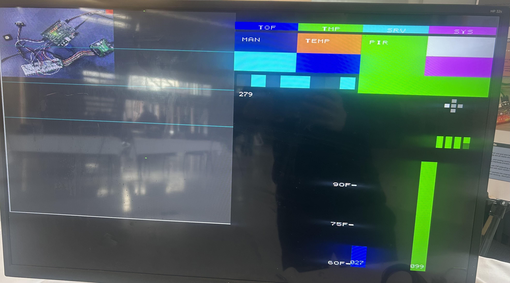
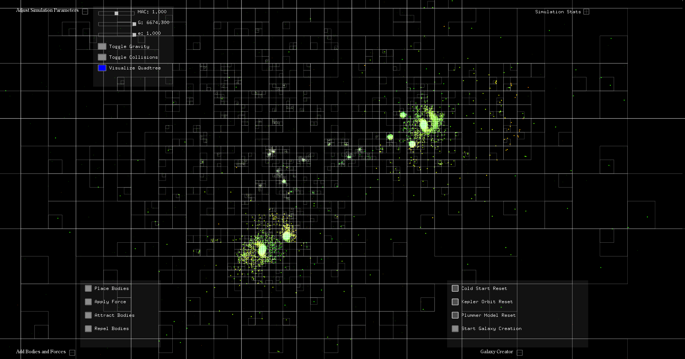
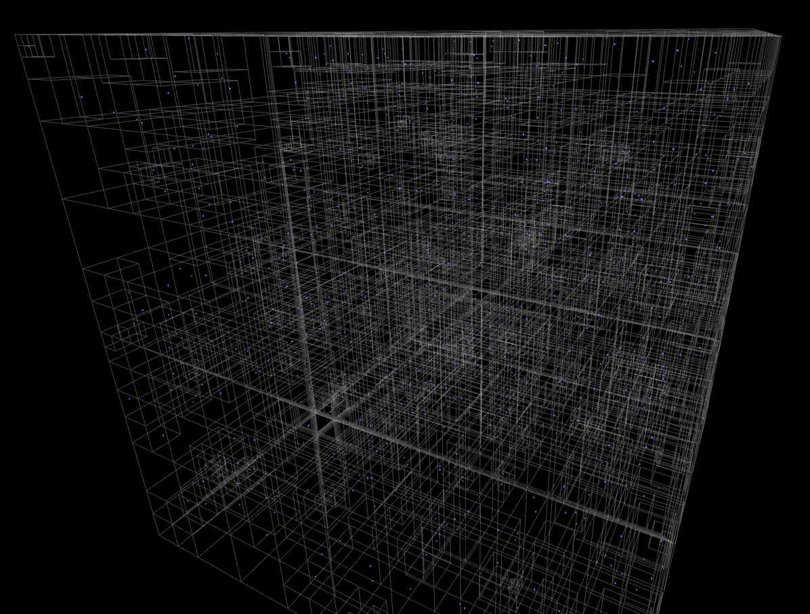

<!-- ============================================================
   DARK/LIGHT MODE ADAPTIVE BANNER (RESPONSIVE)
   ============================================================ -->

  <picture>
    <source media="(prefers-color-scheme: dark)" srcset="assets/banner_vga_dark.png">
    <source media="(prefers-color-scheme: light)" srcset="assets/banner_vga.png">
    
  </picture>

<h1 align="center">David Richardson</h1>
<h3 align="center">
Computer Engineering • FPGA/RTL Systems • Physics-Driven Simulation • Automated Data Analysis
</h3>

---

<b>I build deterministic real-time FPGA sensing systems and physics-driven simulation engines from first principles.</b>

Physical theory → mathematical models → algorithms → RTL/C/C++ → instrumentation → analysis & visualization

<!-- ============================================================
   ANIMATED SVG ORBIT VISUALIZER (NO JS, GITHUB-SAFE)
   ============================================================ -->

  <svg width="260" height="80" viewBox="0 0 260 80" xmlns="http://www.w3.org/2000/svg">
    <defs>
      <linearGradient id="grad-orbit" x1="0%" y1="0%" x2="100%" y2="0%">
        <stop offset="0%" stop-color="#2dd4ff" />
        <stop offset="100%" stop-color="#facc15" />
      </linearGradient>
    </defs>

    <!-- Central Node -->
    <rect x="95" y="22" rx="6" ry="6" width="70" height="36"
          fill="#111827" stroke="url(#grad-orbit)" stroke-width="1.4" />
    <text x="130" y="44" text-anchor="middle" font-size="11"
          fill="#e5e7eb" font-family="system-ui, sans-serif">
      physics → RTL
    </text>

    <!-- Orbit Path -->
    <ellipse cx="130" cy="40" rx="110" ry="28"
             fill="none" stroke="rgba(148,163,184,0.4)"
             stroke-width="1" stroke-dasharray="4 6" />

    <!-- Orbiting Node -->
    <circle cx="240" cy="40" r="4" fill="#facc15">
      <animateMotion
        dur="7s"
        repeatCount="indefinite"
        path="M 20,40 A 110,28 0 1 1 240,40 A 110,28 0 1 1 20,40"
      />
    </circle>

    <!-- Labels -->
    <text x="35" y="20" text-anchor="middle" font-size="9"
          fill="#9ca3af" font-family="system-ui, sans-serif">
      math models
    </text>
    <text x="225" y="66" text-anchor="middle" font-size="9"
          fill="#9ca3af" font-family="system-ui, sans-serif">
      visualization
    </text>
  </svg>

---

# 🧭 Navigation

  <a href="#overview">Overview</a> • 
  <a href="#skills--tools">Skills & Tools</a> •
  <a href="#featured-work">Featured Work</a> • 
  <a href="#thesis-report">Featured Report</a> •
  <a href="#results--gallery">Results</a> • 
  <a href="#technical-ecosystem">Ecosystem</a> • 
  <a href="#highlighted-repositories">Repositories</a>

---

# 🔍 Overview

I design and implement deeply structured engineering systems, including:

- Hardware-only FPGA sensing + control pipelines (no soft CPU)
- CDC-disciplined real-time visualization via VGA HUD overlays
- Barnes–Hut gravitational simulation engines (2D & 3D)
- Telemetry chains: FPGA → UART → CSV → MATLAB analysis
- Documentation-first workflows (RTL + math + LaTeX reports)

My work emphasizes correctness, timing determinism, structured dataflow, and rigorous modeling.

---

# 🚀 Current Focus

- Expanding **FPGA_Signal_Control_System** into full occupancy-map sensor fusion  
- Porting spatial simulation primitives toward hardware acceleration  
- Building instrumentation-first FPGA visualization workflows  

---

# 🛠️ Skills & Tools

## Core Domains

- **FPGA/RTL Design** — synchronous systems, CDC safety, fixed-point arithmetic  
- **Embedded Systems** — peripheral bring-up, register-level engineering  
- **Physics Simulation** — N-body gravity, numerical stability, multipole methods  
- **Data Pipelines** — telemetry decoding, structured datasets, modeling workflows  

## FPGA / RTL Engineering

- CDC-safe Verilog modules (UART, I²C, PWM, VGA, XADC front-ends)
- Ready/valid datapaths, deterministic FSM pipelines
- Q1.15 fixed-point mapping between physical units and digital logic
- Vivado non-project automation with Tcl + timing closure discipline

## Algorithms & Simulation

- Barnes–Hut engines using quadtrees + Morton-encoded hashed octrees  
- O(N log N) multipole approximations with symplectic integration  
- Energy tracking, parameter sweeps, visualization tooling  

---

# 🏗️ Featured Work

## ⚡ FPGA_Signal_Control_System (Artix-7)

*A hardware-only physics control laboratory with live deterministic visualization.*

- Time-of-Flight distance mapping + surveying modes  
- VGA HUD overlay at **640×480 @ 60 Hz**  
- UART telemetry streaming at **2 Mb/s** with CRC framing  
- Temperature → PWM fan control via fixed-point pipelines  
- Strict SYS→PIX CDC snapshot buses for tear-free rendering  

  

---

## 🌌 Barnes–Hut Simulation Engines (2D & 3D)

High-performance gravitational modeling built around:

- Adaptive quadtrees + Morton-ordered hashed octrees  
- O(N log N) scaling multipole approximations  
- Leapfrog / velocity Verlet symplectic integration  
- Real-time visualization and stability diagnostics  

  
  

---

# 📘 Featured Paper / Thesis Report

A central part of my work is producing **full engineering-grade documentation** that unifies:

**physical modeling → mathematical formalization → RTL architecture → verification → visualization.**

### 📄 FPGA_Signal_Control_System — Comprehensive Technical Report  
*A thesis-style systems document covering deterministic FPGA sensing pipelines.*

- CDC doctrine and why asynchronous sampling is explicitly rejected  
- Fixed-point physical unit mapping (Q formats, scaling invariants)  
- SYS→PIX snapshot bus architecture for tear-free VGA HUD rendering  
- Sensor fusion telemetry pipelines (ToF + Sonar + temperature + motion)  
- Instrumentation-first verification: logic analyzer + scope correlation  

🔗 **PDF Report:**  
[Sonar_Fusion_Signal_CAT_Thesis (3).pdf](https://github.com/user-attachments/files/24847481/Sonar_Fusion_Signal_CAT_Thesis.3.pdf)

🔗 **LaTeX Source:** *(add repo/docs link when uploaded)*  

---

# 🎛️ Results & Gallery

<b>Click to expand project visuals</b>

### FPGA Vivado Implementation

### Top-Level RTL Schematic

### Hardware Bench Setup

### MATLAB Telemetry + Modeling View

### VGA Real-Time HUD Output

---

# 🧰 Technical Ecosystem

  
  
  
  
  

---

# 📊 GitHub Activity (Signal-Only)

  
  

---

# 📦 Highlighted Repositories

### 🔗 [FPGA_Signal_Control_System](https://github.com/DavidRichardson02/FPGA_Signal_Control_System)  
Real-time FPGA sensing/control system with ToF mapping, VGA HUD, telemetry, fan/PIR/encoder integration.

### 🔗 [Generic_Quadtree_BarnesHut_Simulator](https://github.com/DavidRichardson02/Generic_Quadtree_BarnesHut_Simulator)  
2D gravitational engine with adaptive quadtree refinement and interactive visualization.

### 🔗 [Hashed_Octree_3D_BarnesHut](https://github.com/DavidRichardson02/Hashed_Octree_3D_BarnesHut)  
3D Barnes–Hut simulation using Morton-encoded hashed octrees for scalable spatial subdivision.

### 🔗 [Automated_CSV_Data_Analysis](https://github.com/DavidRichardson02/Automated_CSV_Data_Analysis)  
C pipeline for dataset modeling, transformations, diagnostics, and telemetry-grade tooling.

---

# 📫 Contact

- LinkedIn: https://www.linkedin.com/in/david-richardson-0099281b6/  
- Email: 02richardsondavid@gmail.com  
- Resume PDF: [Resumë (9).pdf](https://github.com/user-attachments/files/24847510/Resume.9.pdf)  
- Portfolio: https://davidrichardson02.github.io/  

---

<b>Structured. Physics-driven. Deterministic engineering from first principles.</b>

