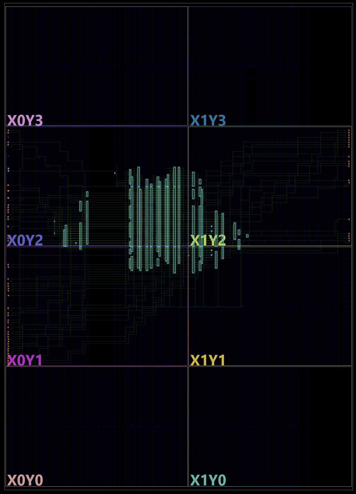
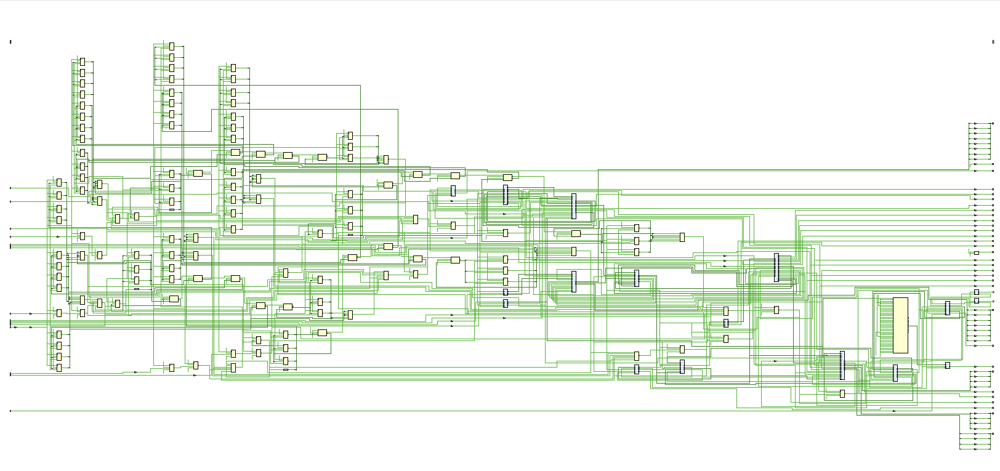
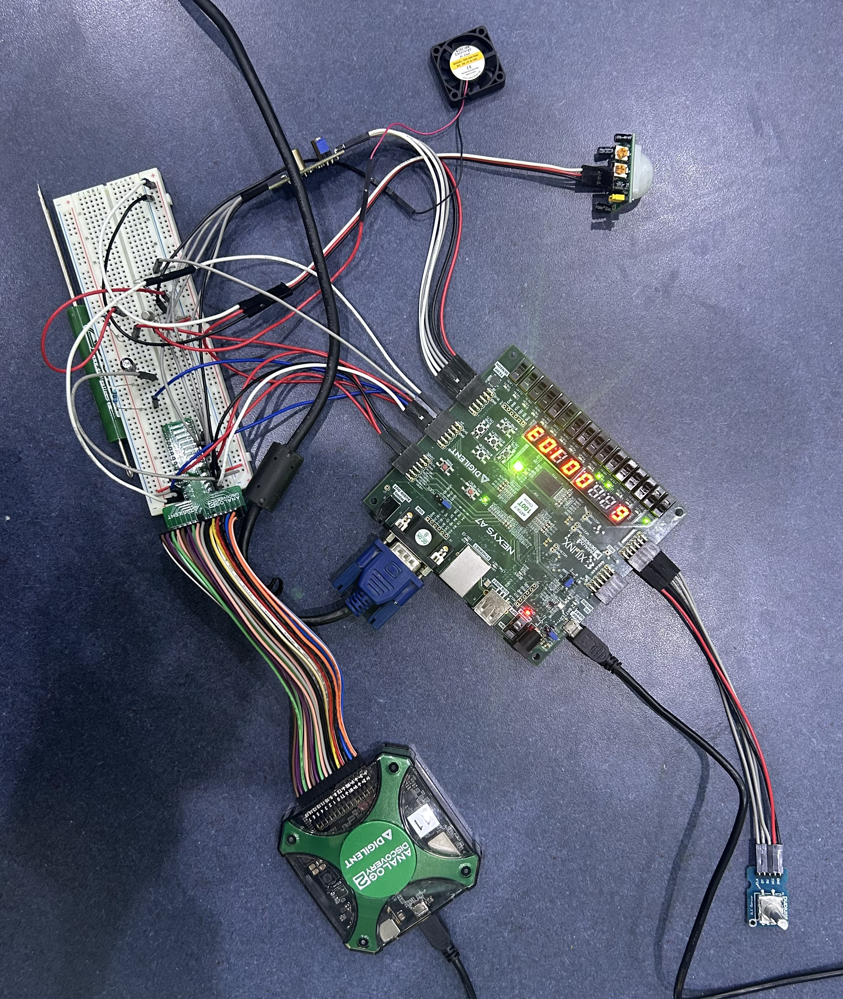
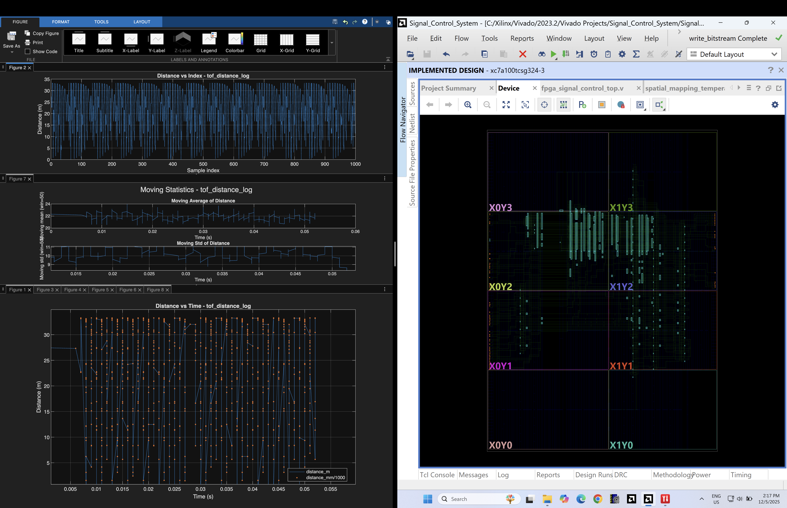
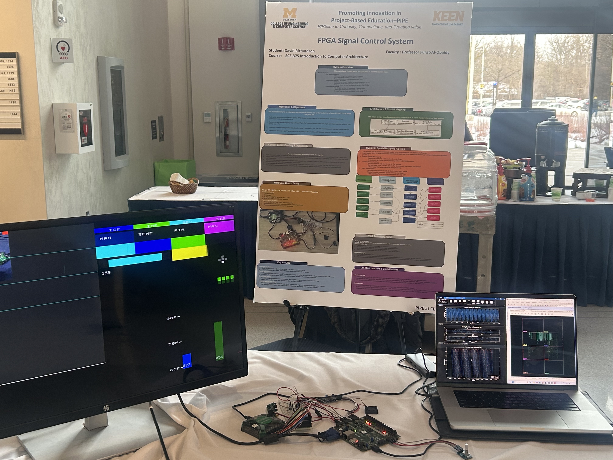

# 👋 Hi, I'm David Richardson  

Computer Engineering student building systems at the intersection of **physics, mathematics, and computation** — from FPGA-based real-time sensing and control to high-performance C++ simulation engines and data analysis pipelines.

I like taking ideas from first principles all the way to hardware and tools:  
**theory → models → algorithms → RTL → instrumentation → analysis**.  
My work emphasizes correctness, timing, structured dataflow, and rigorous documentation.

---

## 🔭 Current Focus

- **FPGA Signal Control System** – Nexys A7 physics control lab with ToF mapping, VGA HUD, UART telemetry, PWM fan control, PIR sensing, and rotary-encoder surveying.  
- **Barnes–Hut N-Body Simulations (2D & 3D)** – C++17 engines using quadtrees and hashed-octrees with Morton ordering for scalable gravitational dynamics.  
- **Automated CSV Analysis Pipeline** – C++17 framework for dataset standardization, modeling, and diagnostics for scientific/engineering logs.

---

## 🚀 Featured Project — FPGA_Signal_Control_System  

A mixed-signal real-time measurement and control platform built entirely in hardware on a **Nexys A7-100T (Artix-7)**.

**What it does**

- **2D spatial mapping** using a Pmod **Time-of-Flight (ISL29501)** sensor swept over angle  
- **Temperature telemetry → PWM fan control** with hysteresis and occupancy extensions  
- **PIR motion sensing** with temporal decay logic  
- **Rotary encoder–driven surveying** and HUD interaction  
- **Structured UART telemetry** (timestamp, θ_q15, dist_mm, temperature, duty, status, CRC)  
- **Full 640×480 VGA pipeline**:
  - ToF range plot with framebuffer + rings/axes  
  - Right-side HUD (temperature bar, fan tiles, PIR, UART counters, angle indicators)  
  - Double-buffered logo/image viewport streamed over UART  

**How it’s built**

- Single 100 MHz fabric clock, with tick-enable–based slow behavior  
- Q1.15 fixed-point numerics shared between RTL, MATLAB, and C++ tools  
- CDC-safe bridges to a 25 MHz pixel clock domain  
- Ready/valid streaming between ToF sensor, packetizer, UART TX/RX, and video/telemetry paths  

(Full theory-of-operation, cheat sheet, and poster live in the project repo and portfolio.)

---

## 🧠 Technical Focus Areas

### Digital / FPGA & Embedded

- Verilog RTL: FSMs, I²C, UART, PWM, XADC front-ends, CDC synchronization  
- VGA timing cores, HUD engines, framebuffer pipelines, and logo/overlay modules  
- Q-format fixed-point modeling (Q1.15) for temperature, angle, duty, and scaling  
- Nexys A7 (Artix-7), HCS12, ARM Cortex-M, UART/I²C/SPI, mixed-signal bench work

### High-Performance C/C++ & Numerical Modeling

- Barnes–Hut kernels, quadtrees, hashed-octrees, Morton ordering  
- Numerical integration and stability-aware simulation loops  
- CSV analytics frameworks (schema inference, transformation, modeling)  
- Tooling and libraries: modern C++17, Eigen/FFTW/OpenMP where appropriate

### Tooling & Workflow

- Vivado Design Suite, WaveForms, MATLAB/Simulink  
- Git/GitHub, CMake/Ninja, CI, cross-platform dev on macOS, Linux, and Windows  

---

## 📦 Selected Repositories

- **FPGA_Signal_Control_System** – Integrated ToF mapping, temperature-based fan control, PIR sensing, rotary surveying, UART telemetry, and VGA HUD on an Artix-7 FPGA.  
- **Generic_Quadtree_BarnesHut_Simulator** – 2D interactive N-body engine with adaptive quadtree partitioning and Barnes–Hut approximation.  
- **Hashed_Octree_3D_BarnesHut** – 3D N-body framework using Morton-ordered hashed octrees for cache-friendly force evaluation.  
- **Automated_CSV_Data_Analysis** – Modular C++17 pipeline for CSV standardization, integrity checks, and statistical modeling across large datasets.  
- **OpenFrameworks_UI_Library** – Lightweight UI layer for visualization tools and simulation control panels.  

---

## 🖼️ Project Gallery

*(Once you add the images to a repo — e.g., `assets/` — you can uncomment these.)*

```markdown
<!--
### FPGA Implemented Design (Vivado)


### Top-Level RTL Schematic


### Hardware Bench Setup


### MATLAB Telemetry + Vivado View


### Competition / Showcase Setup


### VGA Real-Time HUD Output

-->
