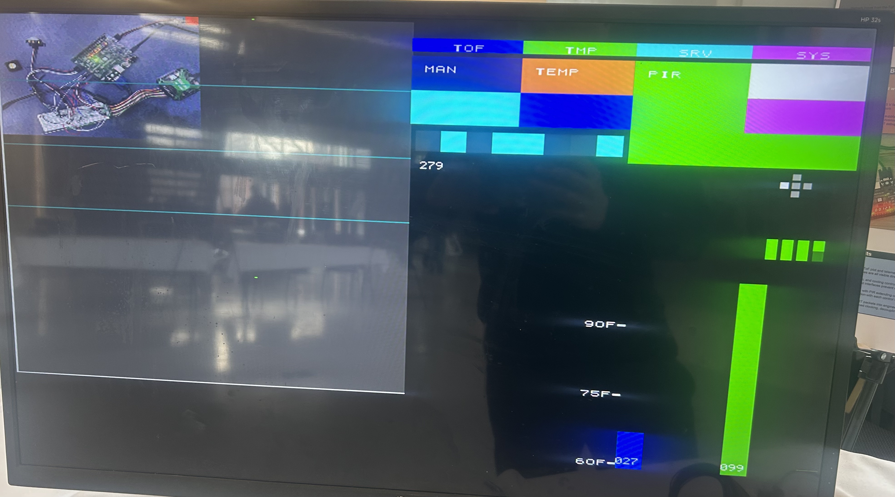
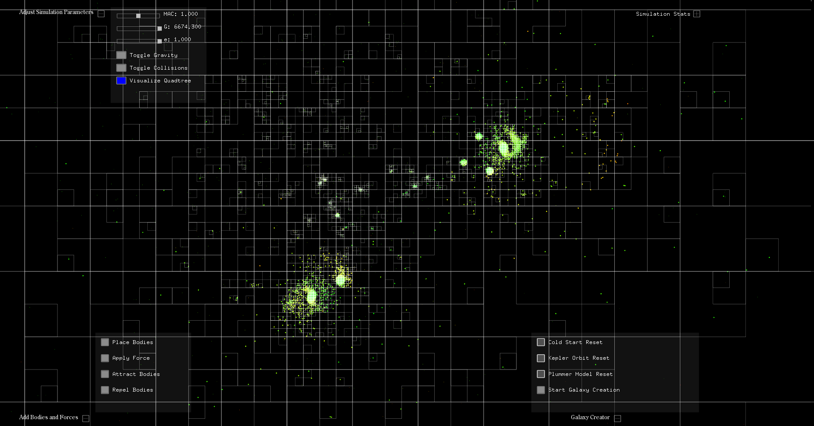
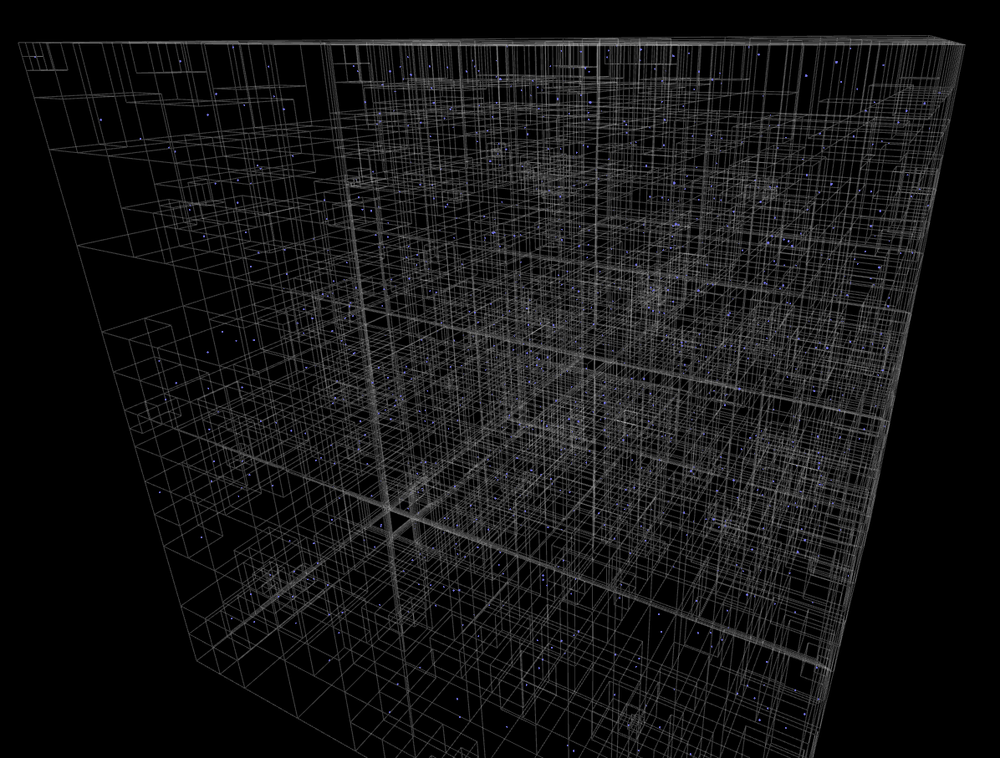

<!-- ========================================================================= -->
<!-- DAVID RICHARDSON — GITHUB PROFILE README                                  -->
<!-- ========================================================================= -->

  <picture>
    <source media="(prefers-color-scheme: dark)" srcset="assets/banner_vga_dark.png">
    <source media="(prefers-color-scheme: light)" srcset="assets/banner_vga.png">
    
  </picture>

<h1 align="center">David Richardson</h1>

  <b>Computer Engineering • FPGA/RTL Systems • Sensor Fusion • Physics-Driven Simulation</b>

  Deterministic digital systems from physical principles to instrumentation, verification, and visualization.

---

## Overview

Engineering work centers on deeply structured digital systems built from first principles, with particular emphasis on:

- deterministic FPGA sensing and control pipelines
- explicit clock-domain crossing discipline
- real-time telemetry and visualization
- physics-driven simulation engines
- documentation-first technical development

Core design philosophy treats engineering as a closed loop:

**physical model → mathematical formalism → algorithm → RTL / C / C++ implementation → instrumentation → verification → visualization**

---

## Current Focus

### AquaFusion Sonar Vision System
A deterministic FPGA instrumentation platform that fuses sonar telemetry, camera video, spatial map accumulation, and HUD rendering into a real-time fishing and environmental-awareness system.

Current technical themes include:

- sonar acquisition using Pmod MAXSONAR
- camera integration using Pcam 5C / OV5640
- explicit SYS→PIX snapshot buses
- tear-free HUD compositing
- observability-first debug architecture
- verification before hardware bring-up

### Deterministic FPGA Visualization
Real-time VGA and HDMI overlay systems with frozen frame semantics, explicit telemetry commit points, and CDC-safe rendering boundaries.

### Physics-Driven Simulation
High-performance Barnes–Hut gravitational simulation engines in 2D and 3D, built with strong emphasis on numerical structure, spatial hierarchy, and performance scaling.

---

## Featured Projects

### AquaFusion_Sonar_Vision_System
**FPGA sonar + camera fusion for real-time environmental awareness and heads-up display rendering**

AquaFusion is a portfolio-grade FPGA instrument designed around deterministic execution and observability. The system fuses:

- ultrasonic ranging telemetry
- camera video input
- spatial mapping
- persistent overlay rendering
- real-time debug visibility

Key engineering concerns include:

- synchronized telemetry snapshot publication
- explicit clock-domain boundaries
- no asynchronous multi-bit sampling
- stable frame-aligned visualization
- instrumentation-driven hardware validation

**Representative architecture themes**
- sonar UART parsing and validity tracking
- camera control and SCCB configuration
- HUD overlay compositing
- map/history accumulation
- debug counters, freshness timers, and fault observability

---

### FPGA_Signal_Control_System
**Hardware-only sensing, control, and visualization on Artix-7**

A real-time FPGA control laboratory built around deterministic pipelines and live VGA output.

Highlights:
- VGA HUD rendering at **640×480 @ 60 Hz**
- fixed-point control and physical-unit mapping
- UART telemetry streaming
- PWM output generation
- temperature and motion instrumentation
- CDC-safe snapshot transfer into the rendering domain

  

---

### Barnes–Hut Simulation Engines
**Physics-driven gravitational simulation in 2D and 3D**

High-performance simulation work built around structured spatial decomposition and scalable force approximation.

Key elements:
- adaptive quadtrees
- Morton-encoded hashed octrees
- multipole approximation
- symplectic integration
- energy and stability analysis
- real-time visualization tooling

  
  

---

## Engineering Interests

### FPGA / RTL Systems
- synchronous digital architecture
- CDC-safe multi-domain systems
- VGA / HDMI rendering pipelines
- UART, I2C, PWM, and sensor interfaces
- fixed-point arithmetic and physical-unit mapping
- observability-first instrumentation design

### Embedded and Low-Level Systems
- register-level peripheral reasoning
- hardware/software interface discipline
- real-bench validation workflows
- timing-aware protocol debugging

### Simulation and Numerical Computing
- N-body gravitational systems
- hierarchical spatial data structures
- performance-oriented C++ design
- numerical stability and error-aware modeling

### Telemetry and Data Pipelines
- structured binary and CSV pipelines
- MATLAB and Python analysis workflows
- automated telemetry decoding
- experimental visualization and diagnostics

### Technical Documentation
- thesis-style engineering reports
- architecture documentation
- timing and interface contracts
- derivation-centered technical writing
- LaTeX-based reproducible documentation

---

## Skills and Tools

### Languages
- Verilog
- C
- C++
- Python
- MATLAB
- Tcl
- LaTeX
- Assembly

### FPGA / Hardware Toolchain
- Xilinx Vivado
- XDC constraints
- non-project Tcl flows
- timing closure workflows
- waveform and logic-level debug

### Bench Instrumentation
- Digilent Analog Discovery 2
- Digilent Analog Discovery 3
- oscilloscope / logic analyzer correlation
- protocol timing validation
- hardware bring-up debugging

### Core Technical Themes
- deterministic state machines
- ready/valid dataflow
- fixed-point systems
- synchronous rendering
- spatial mapping
- simulation-backed engineering

---

## Selected Results

<b>Expand gallery</b>

### FPGA Implementation

### Top-Level RTL Schematic

### Bench Setup

### MATLAB Telemetry and Modeling

### Real-Time HUD Output

---

## Featured Documentation

A major part of the portfolio is not only implementation, but rigorous technical explanation.

Documentation work typically unifies:

- physical motivation
- mathematical formulation
- architectural contracts
- implementation details
- verification strategy
- instrumentation and analysis

### Example Report
**FPGA_Signal_Control_System — Comprehensive Technical Report**

Topics include:
- CDC doctrine and forbidden crossing patterns
- fixed-point scaling and physical-unit contracts
- SYS→PIX snapshot architecture
- telemetry and visualization pipelines
- verification with instrumentation correlation

**PDF Report**  
[Sonar_Fusion_Signal_CAT_Thesis (3).pdf](https://github.com/user-attachments/files/24847481/Sonar_Fusion_Signal_CAT_Thesis.3.pdf)

---

## Highlighted Repositories

### [AquaFusion_Sonar_Vision_System](https://github.com/DavidRichardson02/AquaFusion_Sonar_Vision_System)
Deterministic FPGA sonar + camera fusion system with HUD rendering, telemetry, and spatial mapping.

### [FPGA_Signal_Control_System](https://github.com/DavidRichardson02/FPGA_Signal_Control_System)
Real-time FPGA sensing and control system with VGA HUD, telemetry, and fixed-point physical pipelines.

### [Generic_Quadtree_BarnesHut_Simulator](https://github.com/DavidRichardson02/Generic_Quadtree_BarnesHut_Simulator)
2D gravitational simulation using adaptive quadtrees and scalable Barnes–Hut approximation.

### [Hashed_Octree_3D_BarnesHut](https://github.com/DavidRichardson02/Hashed_Octree_3D_BarnesHut)
3D Barnes–Hut engine using Morton-encoded hashed octrees for spatial subdivision.

### [Automated_CSV_Data_Analysis](https://github.com/DavidRichardson02/Automated_CSV_Data_Analysis)
C-based pipeline for structured data modeling, transformations, diagnostics, and telemetry-grade analysis.

---

## GitHub Activity

  
  

---

## Contact

- LinkedIn: `linkedin.com/in/david-richardson-0099281b6`
- Email: `02richardsondavid@gmail.com`
- Portfolio: `davidrichardson02.github.io`
- Resume: [Resumë (9).pdf](https://github.com/user-attachments/files/24847510/Resume.9.pdf)

---

  <b>Structured. Deterministic. Physics-driven engineering from first principles.</b>

